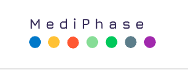
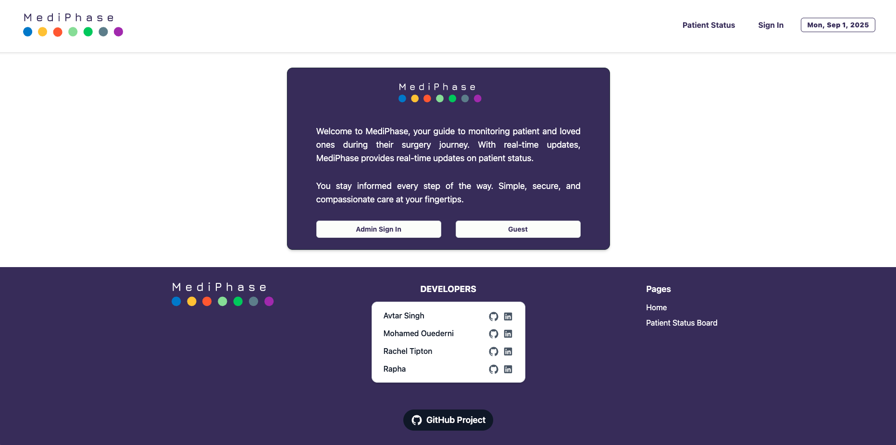
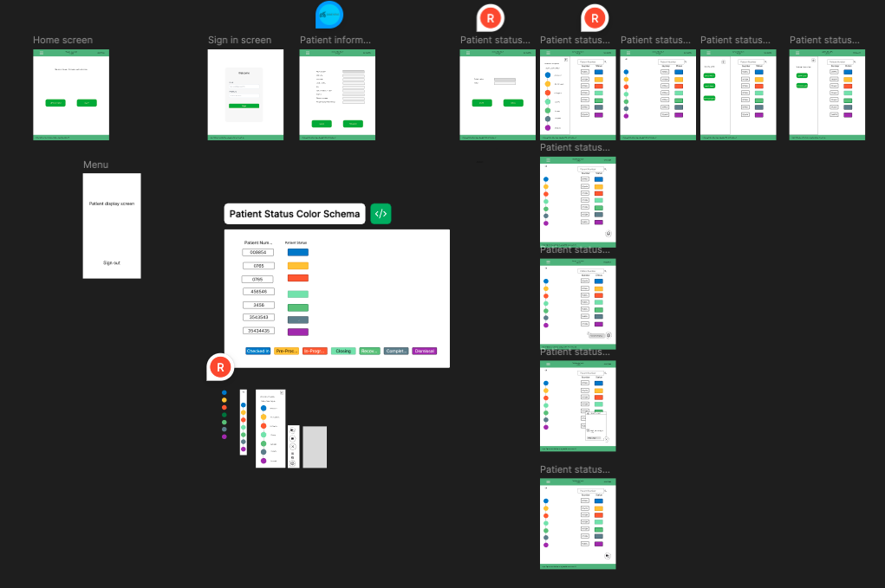
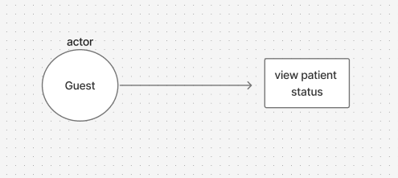
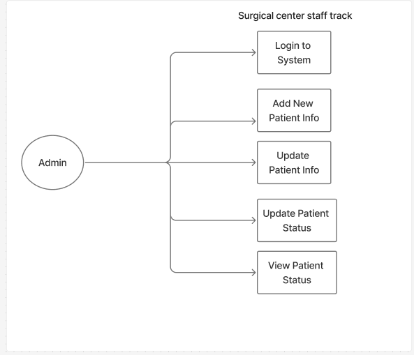
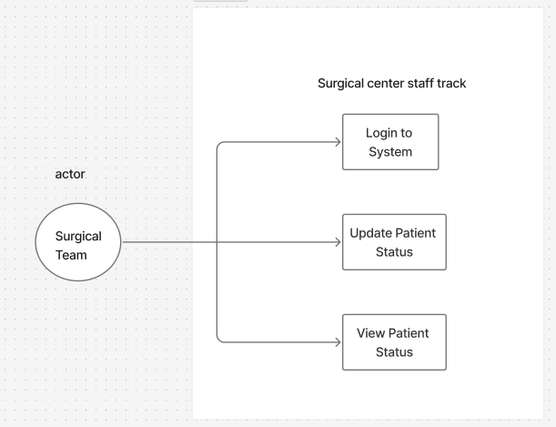
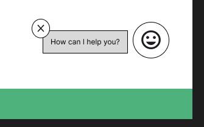
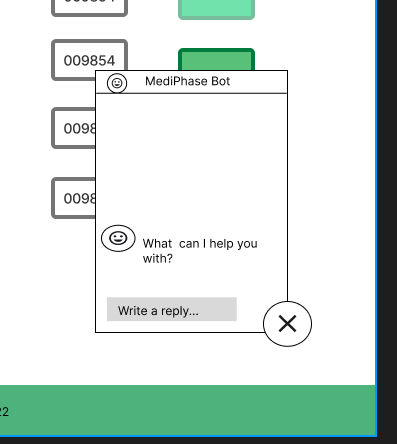
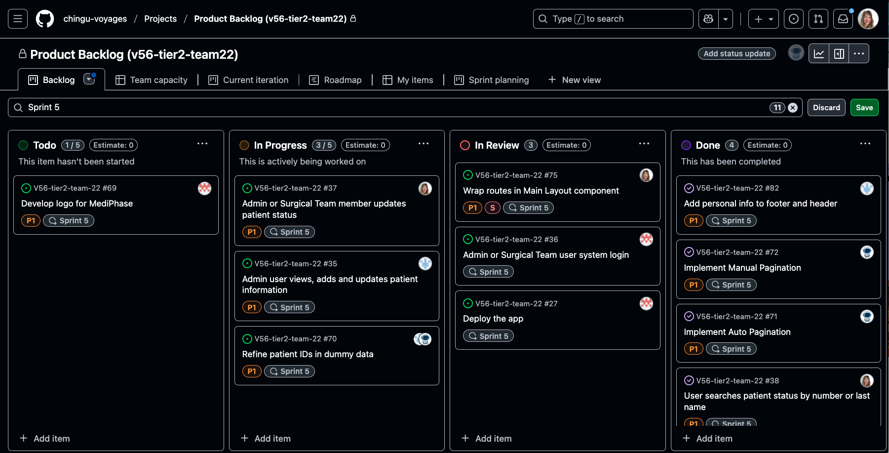
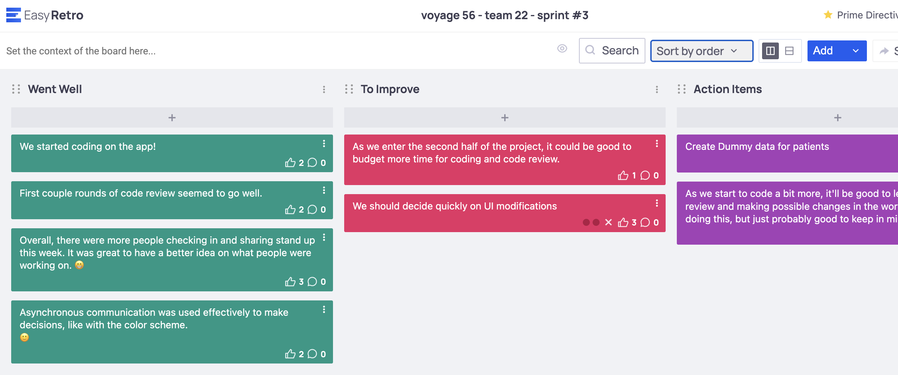

# MediPhase 



MediPhase is a surgery status app that helps medical teams monitor a patient's surgery journey with ease. MediPhase provides real-time updates on surgical patient status. 

MediPhase offers simple, secure, and compassionate care at your medical team's fingertips.



**Deployed App**: [MediPhase](https://mediphase-surgery-status-app.vercel.app/)

## Project Overview 

As part of Chingu Voyage 56, our team, Team 22, built MediPhase as a Frontend Project. 

Given a [project spec](https://github.com/chingu-voyages/voyage-project-surgerystatus) for a surgery status board, over the course of **6 weeks**, everyone on the team contributed **8-12** hours of work to the project. The team collaborated by employing agile methodologies, implementing standups and weekly sprint planning and retro meetings as well as pair programming sessions. We took a spec to a functioning, deployed app. 

The main feature of MediPhase is a dashboard that communicates with **Guest** users in a surgery waiting room or via  web application what phase of the surgery their loved-one is in: 

 `Checked In`
 `Pre-Procedure`
 `In-Progress`
 `Closing`
 `Recovery`
 `Complete`

 Once a patient's status is updated to `Dismissed`, the patient is removed from the screen. 

 **Admin** users are able to create, view and update patient information, including what status a patient is in in their surgery. 

 **Surgical Staff** users are able to lookup a patient by ID number and update their surgical status. 

## Tech Stack & Dependencies 

Mediphase uses the following tech stack and core dependencies:  

### Tech Stack
- [Figma](https://www.figma.com/)
- [Vite](https://vite.dev/) 
- [React](https://react.dev/) 
- [TypeScript](https://www.typescriptlang.org/) 
- [Tailwind](https://tailwindcss.com/) 
- [ESLint](https://eslint.org/)
- [Vercel](https://vercel.com/)

### Dependencies 
- [React Router](https://reactrouter.com/home)
- [Shadcn/ui](https://ui.shadcn.com/)
- [React Hook Form](https://www.react-hook-form.com/get-started/)
- [Sonner](https://www.npmjs.com/package/sonner) 
- [Zod](https://zod.dev/) 
- [React Icons](https://react-icons.github.io/react-icons/)
- [TanStack Table](https://tanstack.com/table/latest)

## UI/UX Design 

The team used **Figma** to create wireframes to develop the design and interactivity of the app. 



Figma was also used to create UML diagrams that helped us better understand user processes and workflows for guest, admin and surgical team stories. 







## Features 

### Folder Structure

The project is organized as follows:

```
/src
  /assets           # Static assets (images, icons, etc.)
  /components       # Reusable UI components and shared logic
    /PatientStatusTable   # Patient table, forms, and related components
    /Footer               # Footer and related components
    /ui                   # UI primitives (buttons, inputs, etc.)
    ...
  /constant         # Static constants and configuration
  /contexts         # React Context providers (e.g., user role)
  /hooks            # Custom React hooks
  /layout           # Layout components (wrappers, containers)
  /lib              # Utility functions and helpers
  /screens          # Top-level pages/screens (AddPatient, UpdateInfo, etc.)
  App.tsx           # Main app component
  main.tsx          # App entry point
  routes.tsx         # Route definitions
  index.css         # Global styles
```

- **/src/screens**: Each screen/page in the app (e.g., AddPatient, UpdateInfo, PatientStatusBoard).
- **/src/components**: Reusable components, grouped by feature or type.
- **/src/hooks**: Custom hooks for shared logic.
- **/src/contexts**: Context providers for global state (e.g., user authentication).
- **/src/constant**: Static data and configuration.
- **/src/layout**: Layout components for consistent page structure.
- **/src/lib**: Utility functions and helpers.
- **/src/assets**: Images and other static files.

This structure helps keep code modular, maintainable, and easy to navigate as the project grows.

### Storage

* This project uses React's Context API to manage and globally store the current user role within the application during the user's session.

* Once a user logs in, their role (e.g., Admin, Surgical Staff) is saved to Local Storage. This stored role is then used to authorize and control which routes and features the user can access throughout the app.

* Patient data is initially loaded from a static JSON object, but any updates (such as adding, editing, or dismissing a patient) are saved to the browser's Local Storage. This ensures that changes to patient data persist across page refreshes during the user's session.

* On app load, the patient data is retrieved from Local Storage if available; otherwise, it falls back to the default JSON data.

* As a more frontend-focused app, we decided to use Local Storage for any data that needs to be persisted across page refreshes. 

### User-based Features

- **Role-based Functionality:**  
  - **Admin** users can add, view, and update patient information, including updating patient status.
  - **Surgical Staff** users can look up patients by ID and update their surgical status.
  - **Guest** users can view the current status of patients but cannot make changes.
- **Real-time Patient Status Dashboard:**  
  - All users can view a dashboard showing the current status of patients as they move through each phase of surgery.
  - Patients are automatically removed from the dashboard when their status is updated to `Dismissal`.

### Notable Code-based Features

- **Context API for User Authentication and Role Management:**  
  The app uses React’s Context API to manage authentication state and user roles globally, enabling role-based routing and feature access.

  <details>
  <summary>View code</summary>
   
   ```tsx
   
  // src/contexts/AuthContext.tsx

  export const AuthContext = createContext<AuthContextType | null>(null);
  export const AuthProvider = ({ children }: { children: React.ReactNode }) => {
  const [user, setUser] = useState<User>(() => {
    const storedUser = localStorage.getItem('user');
    return storedUser ? JSON.parse(storedUser) : null;
  });

  useEffect(() => {
    if (user) {
      localStorage.setItem('user', JSON.stringify(user));
    } else {
      localStorage.removeItem('user');
    }
  }, [user]);

  const signIn = (email: string, password: string) => {
    const storedUser = users.find((credential) => credential.email === email);

    if (!storedUser) {
      return Promise.reject(new AuthError(INVALID_EMAIL_MSG));
    }

    if (storedUser.password !== password) {
      return Promise.reject(new AuthError(INVALID_PASSWORD_MSG));
    }
    //eslint-disable-next-line
    const { password: _, ...userProps } = storedUser as User & {
      password: string;
    };
    setUser(userProps);
    return Promise.resolve(userProps);
  };

  const signInAsGuest = () =>
    setUser({
      id: uuidv4(),
      role: 'guest',
    });

  const signOut = () => setUser(null);

  return (
    <AuthContext.Provider value={{ user, signIn, signInAsGuest, signOut }}>
      {children}
    </AuthContext.Provider>
  );
  };
  ```
  </details>

- **Local Storage for Data Persistence:**  
  Patient data and user roles are stored in browser Local Storage.  
  Patient data is initially loaded from a static JSON object, but any changes (add, edit, dismiss) are saved to Local Storage, so updates persist across page refreshes.
  An example of this is the `updatePatientStatus` method.

  <details>
  <summary>View code</summary>

  ```tsx
  
  // src/utility/patientHelpers.ts

  export function updatePatientStatus(id: string, newStatus: string) {
  const patients = JSON.parse(localStorage.getItem("patients") || "[]");
  console.log("Before update:", patients);
  const idx = patients.findIndex((p: Patient) => p.id === id);
  if (idx !== -1) {
    patients[idx].status = newStatus;
     // Lookup color/message
     const statusMetaData = statusInfo.find(s => s.status === newStatus);
     if (statusMetaData) {
       patients[idx].color = statusMetaData.color;
       patients[idx].message = statusMetaData.message;
     }
    localStorage.setItem("patients", JSON.stringify(patients));
    console.log("After update:", patients);
    return patients[idx];
  }
  return null;
  }
  ```
  </details>

- **Automatic Table Pagination:**  
  The patient dashboard uses TanStack Table for flexible, filterable, and paginated data display.  
  In **auto mode**, the table automatically moves to the next page after 20 seconds, allowing users in waiting rooms to see all patients in rotation without manual interaction.

  <details>
  <summary>View code</summary>
 
  ```tsx
  
  // src/components/PatientStatusTable/PaginationController.tsx
  
  // auto pagination every 15 seconds
  useEffect(() => {
    if (paginationMode !== 'auto') {
      setCountdown(20);
      return;
    }
    setCountdown(20);
    if (paginationMode !== 'auto') return;
    const interval = setInterval(() => {
      setCountdown((prev) => {
        if (prev <= 1) {
          const currentPageIndex = table.getState().pagination.pageIndex;
          const pageCount = table.getPageCount();
          if (pageCount > 0) {
            if (currentPageIndex < pageCount - 1) {
              table.nextPage();
            } else {
              table.setPageIndex(0);
            }
          }
          return 20;
        }
        return prev - 1;
      });
    }, 1000);
    return () => clearInterval(interval);
  }, [paginationMode, table]);
  ```
</details>

- **Dynamic Table and Forms:**  
  The patient dashboard uses TanStack Table for flexible, filterable, and paginated data display.
  Forms for adding and updating patients use React Hook Form and Zod for validation and type safety.

- **Responsive UI:**  
  The app is built with Tailwind CSS and shadcn/ui primitives for a modern, accessible, and responsive design.


## Running Mediphase

Clone the repository locally:
`git clone https://github.com/chingu-voyages/V56-tier2-team-22.git`

If not already there, navigate to the project folder:
`cd v56-team22-surgery-status-board`

Install dependencies: 
`npm install` or `npm i`

Run the app: 
`npm run dev` 

#### Login Credentials

To access features on protected routes dedicated to **Admin** and **Surgical Staff** users, use the following credentials: 

**Admin User**
  Email: `admin@mediphase.com`
  Password: `admin`
 
**Surgical Staff User**
  Email:`surgeon@mediphase.com`
  Password:`surgeon`


## Future TODO List 

With every project, there are always stretch goals that are out of reach when the deadline arrives. 

Here are a few TODOs that are left at the end of the project: 

- [ ] Playwright or Cypress Testing: There was an idea to add frontend testing to the app, but it wasn't completed by the deadline. 
- [ ] Gemini AI Integration with a Chatbot (the chatbot is designed, not implemented). 




## Our Team

We are 4 developers living in 4 different countries brought together by Chingu Voyage 56 in early July 2025. 

Before being accepted to the Voyage, we all completed a Solo Project. 

- Rachel Tipton: [GitHub](https://github.com/rachel-labri-tipton) / [LinkedIn](https://www.linkedin.com/in/rachel-labri-tipton/)
- Mohamed Ouederni: [GitHub](https://github.com/9-barristanselmy-9) / [LinkedIn](https://www.linkedin.com/in/mohamed-ouederni-0bb11ab4/)
- Avtar Singh: [GitHub](https://github.com/ManpreetSL) / [LinkedIn](https://www.linkedin.com/in/avtar-singh-uk/)
- Rapha Chris: [Github](https://github.com/Excalibur097) / [LinkedIn](https://www.linkedin.com/in/sugari-rapha-8823a58a)

It's hard to dedicate time in a busy schedule to a side project. And everyone on Team 22 showed up week after week to code, refine and complete tickets, reflect on how the process was going, review code and build together. 


### Wins 

Here are the wins our team had over the course of the voyage: 

- Building an app in community with others and sharing our knowledge with each other. 
- Gaining a better understanding of Agile Methodologies in practice. As a team, we had weekly sprint planning, review and retro meetings. Some of the tools we used were **Easy Retro** and **GitHub Projects** to help organize work. 






### Challenges

 Chingu projects are often assigned a Product Owner or a Voyage Guide. Our team didn't have either of these, so the members of the team that had more professional experience stepped in to organize and run planning meetings, set up a GitHub Project for Product Backlog, etc. This is not always easy when everybody just wants to jump in and code. 

 

 
